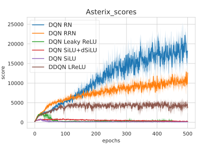

# Rational Reinforcement Learning Repository

Using Rational Networks in Simple Reinforcement Learning (Atati task so far).

## Dependencies
This Repository depends on:
* [MushroomRL](https://github.com/MushroomRL/mushroom-rl) for managing agents, environments, ... etc
* [Rational Activation Functions](https://github.com/ml-research/activation_functions) for the learnable rational activation functions
* Pytorch - For the neural network part

## Installation
First, please clone this repo and go into it:

    git clone https://github.com/ml-research/rational_rl
    cd rational_rl

A Dockerfile is provided, to create a docker image, please run:

    docker build -t rationalrl . # to create a docker image
    docker run -ti --gpus all -v $(pwd):/home/rl_paus rationalrl bash

This last command will instantiate a container from your image and run bash into it.*

\*You need to have [nvidia-docker](https://docs.nvidia.com/datacenter/cloud-native/container-toolkit/install-guide.html#docker) installed to run docker containers with GPU and CUDA support (otherwise, please drop `--gpu all`).

## Watch a trained agent play:
To watch a trained Recurrent Rational agent on Kangaroo, please provide its path:  
`python3 rendering_atari.py updated_agents/DQN_recrat_Kangaroo_s0_e500.zip`
Hereafter are provided some compiled example of DQN Agents (*left* with Leaky ReLU, *center* with Rational and *right* with Recurrent Rationals)
* Enduro
  
* Kangaroo
  
* SpaceInvaders
  
* Tennis
   *Agent is orange
* TimePilot
  
* Tutankham
  

you can find more gifs in `videos/gifs_files/optim/Asterix`
## Usage
* To train a DQN agent on Space Invaders, with recurrent rational and seed set to 0:  
`python3 train.py -g SpaceInvaders -alg DQN -af rpau -s 0`

* To make the scores plot of the agent on Asterix and store it: 
`python3 scores_evolutions_graph.py -g Asterix -s`  
Creating the following image:  

* To get the raw scores on all activation functions and all game: 
`python3 scores_table.py --all`

* To get the bar plot comparing rational agents and original [Leaky ReLU] agent.
`python3 bar_plot_human_compare.py -h`

To get the trained agents, please contact [Quentin Delfosse](mailto:quentin.delfosse@cs.tu-darmstadt.de)
